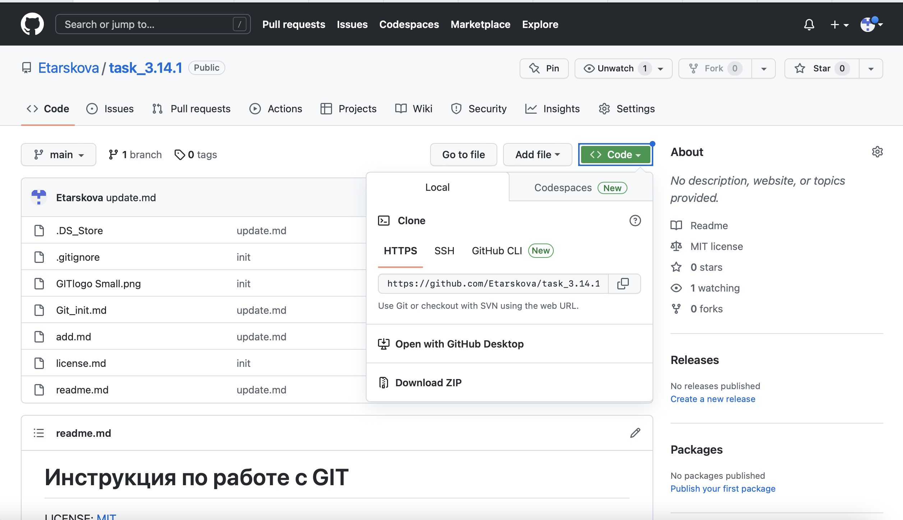

[< к содержанию](readme.md)

## *Git clone*

*Git clone* - это команда для загрузки существующего исходного кода из удаленного репозитория (например, Github). Другими словами, Git clone в основном создает идентичную копию последней версии проекта в репозитории и сохраняет ее на вашем компьютере.

Есть несколько способов загрузить исходный код, например можно клонировать с помощью https:

```bash=
git clone <https://name-of-the-repository-link>
```

Например, если мы хотим загрузить проект с Github, все, что нужно сделать, это нажать на зеленую кнопку (клонировать или загрузить), скопировать URL-адрес в поле и вставить его после команды git clone, которая показана прямо выше



Это создаст копию проекта в вашей локальной рабочей области, чтобы вы могли начать с ним работать.

[<к предыдущей главе](push.md)