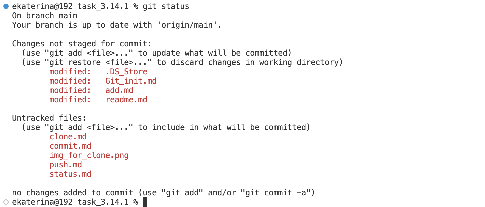

[< к содержанию](readme.md)

## *Git status*

Команда Git status предоставляет нам всю необходимую информацию о текущей ветке. Вызывается она следующим образом:

```bash=
git status
```

Мы можем собирать такую информацию, как:
+ является ли текущая ветка актуальной;
+ есть ли что-нибудь для фиксации, нажатия или вытягивания;
+ есть ли файлы созданные, измененные или удаленные. 



[<к предыдущей главе](commit.md)   
[следующая глава>](push.md)